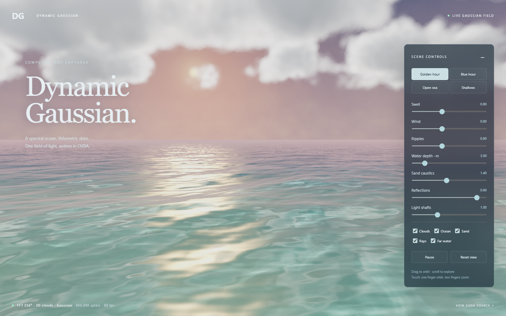

# Dynamic Gaussian

[Live demo](https://samg-coder.github.io/dynamic-gaussian/) · [Deployment workflow](https://github.com/SamG-Coder/dynamic-gaussian/actions/workflows/pages.yml)

A standalone CUDA WebShader / Three.js experiment. CUDA supplies the FFT water, per-pixel water shading, sand caustics, and dynamic Gaussian cloud field. Three r186 owns the camera, controls, Gaussian projection/sorting, and presentation on the same GPUDevice. JavaScript records passes and supplies input; it does not generate the animated scene.

## Run locally

```sh
git clone https://github.com/SamG-Coder/dynamic-gaussian.git
cd dynamic-gaussian
npm ci
npm start
```

Open http://localhost:5173/ in a WebGPU browser. The experiment explicitly requests WebGPU; it does not request native CUDA permissions.

## Rendering pipeline

1. `ocean-fft.cu`: deterministic Phillips spectrum and Hermitian time evolution; three batched inverse FFTs generate height and horizontal displacement, followed by slopes and compression-based foam input.
2. `volume.cu`: surrounding, advected three-dimensional weather/density field, with independent billow, erosion, and growth scales. Sun and sky transmittance are baked into a 96 x 40 x 96 light volume. A shared approximate scattering function lights both visible clouds and their reflections.
3. `caustics.cu`: sunlight refracts through the moving FFT/ripple surface and deposits fixed-point photon flux on an analytic submerged sand bed. The sand's base illumination remains positive; increasing caustic strength adds focused light instead of turning defocused areas black.
4. `scene.cu` and `splat-pipeline.js`: CUDA generates cloud/sky/fog/sun centers, covariances, and colors into Three's storage buffers; all Gaussian layers share one GPU counting sort.
5. `water.cu` and `water-renderer.js`: each framebuffer pixel traces the continuous FFT height field, computes reflection and Snell refraction, intersects the refracted ray with the sand, samples caustics at that bed intersection, and applies water-path absorption. Three TSL presents the computed pixel buffer over the atmospheric scene. Transparent pixels preserve the sky.

Water is deliberately not rasterized as overlapping transparent Gaussians: that exposed soft footprints and holes. It is also not shaded by interpolating coarse vertex colors: that exposed a grid in the caustics and reflections. One per-pixel CUDA pass now covers near water through the horizon, eliminating the separate near/far surface boundary. Gaussian rendering remains the volumetric branch of the reusable pipeline.

Caustics contribute exclusively to sand radiance. They are never added directly to the water reflection or foam. Disabling Sand makes the caustic-strength slider produce zero changed water pixels, which the GPU regression test asserts. Disabling Ocean while leaving Sand enabled reveals the illuminated bed directly for inspection.

## Allocations and controls

| Allocation | Desktop | Initial viewport under 700 px |
|---|---:|---:|
| Gaussian samples, including sky/fog/sun | 660,496 | 58,896 |
| FFT resolution | 256 x 256 | 128 x 128 |
| Caustic photon/map resolution | 1024 x 1024 | 512 x 512 |
| Density/light volume | 96 x 40 x 96 | 96 x 40 x 96 |

The FFT covers a periodic 256-unit patch. Water rays extend up to 6 km in all azimuths; short waves and cloud reflections fade smoothly with distance. Clouds occupy a surrounding world box from (-240, 8, -240) to (240, 160, 240), with wind advection, changing coverage, and rising density detail. They are not a collection of camera-facing cloud props. Their density changes even with wind at zero.

Drag or use one finger to orbit through the full 360 degrees; wheel/two fingers zoom. Four presets and sliders expose swell, wind, ripples, depth, seabed caustics, reflections and shafts. Layer switches, pause/resume, and reset view are provided. Shallows raises the camera and reduces swell so the refracted sand is easier to inspect. Mobile controls start collapsed. Resizing updates the camera, framebuffer and pixel buffer; reload to change the allocation tier. Pixel ratio is capped at 1.5 on desktop and 1 on mobile.

The normal frame schedule has no scene readback, CPU position upload, resource allocation, or completion wait. Resizing reallocates the pixel buffer. The displayed FPS measures browser frame cadence, not isolated GPU time.

## Extending the pipeline

`CudaSplatPipeline.create` takes CUDA source, a simulation, and layer entries with a kernel entry, count and scalar callback. Shared buffers contain centers, covariance A=(xx,xy,xz,yy), covariance B=(yz,zz,0,0), and packed linear RGBA8 colors. Only CUDA changes their contents. CPU arrays are allocation seeds, not current scene data.

`OceanAtmosphere.record` records simulation passes into a runtime batch. `CudaWaterRenderer` records a separate per-pixel compute pass on the same queue, followed by Three presentation. Its TSL nodes only address and unpack the shared pixel buffer; shading remains in `.cu`.

The Gaussian adapter accesses Three r186 private storage/sort fields and must be revalidated before a Three upgrade. It uses conservative bounds, disables stale-CPU picking, and invalidates the static-scene sort cache every frame. Logarithmic 4096-bin depth ordering balances near-volume and distant-sky precision. Every allocated Gaussian is sorted, including transparent samples.

## Limits

- This remains a rendering experiment. Clouds are brighter, varied and animated, but Gaussian footprints and finite density resolution remain visible, especially on the mobile tier. The lighting uses a multiple-scattering approximation, not a physical multiple-scattering solve.
- The ocean is a periodic deep-water spectral model plus analytic gravity/capillary ripples. It has no shoreline interaction, breaking-wave solver, or foam transport. Extreme swell over a very shallow bed is not physically constrained.
- Water uses bounded ray/height-field intersection and an approximate inverse horizontal displacement. There is no underwater camera mode or temporal antialiasing. Distant fine detail can shimmer.
- Reflections march 40 samples through the shared cloud light volume near the camera and transition to sky/sun farther away. Arbitrary imported objects, water multiple bounces, and scene-wide ray tracing are not included.
- Caustics use a camera-centered periodic photon map, finite photon footprints, and analytic sand intersections. Cloud shadows are not yet applied to the photon emitter.
- Water presentation is a final screen-space pass without mesh depth integration. Imported mesh occlusion and fog/shaft integration in front of water need a dedicated depth/compositing path. This is not a finished general-purpose renderer for arbitrary large assets.
- Mobile validation is emulation on the desktop GPU, not a physical phone performance claim.

## Validation

Run `npm run test:browser` from the repository root. It launches installed Microsoft Edge with real WebGPU and a temporary local server.

The checks cover: finite GPU data and positive-definite covariances; a complete globally sorted permutation; zero frame-loop scene upload/readback; independent GPU FFT versus direct inverse DFT; Hermitian symmetry and real-valued spatial output; density/light self-shadowing; clouds in all four quadrants; drift and cloud formation with zero wind; water coverage in four camera directions; per-pixel water animation, reflections, ripples and depth response; caustic energy and motion; caustics on sand with no effect when sand is hidden; non-darkening caustic strength; preset/pause/touch controls; layout and disposal.

`evidence/validation.json` records results. Screenshots include the initial view, later cloud formation, reverse view, shallow water, isolated sand, open sea and mobile layout. Validation readbacks are only in the test.

## Build and publish

```sh
npm run check
npm run build
```

The static site is written to `dist/`. Actions checks JavaScript syntax, compiles every CUDA entry, verifies the vendored compiler/runtime hashes, and validates the staged browser module graph. Pull requests run these checks; pushes to `main` also deploy GitHub Pages. The workflow uses GitHub's Pages artifact and deployment actions, without a separate deployment branch or stored deployment token.

The site ships its complete compiler/runtime dependency graph and pinned Three.js files. All import and fetch URLs are relative, so the project works under its GitHub Pages repository path. `dist/asset-manifest.json` records SHA-256 hashes for deployed assets.

This repository is independent of the CUDA WebShader checkout. Its 42 required compiler/runtime modules are vendored under `vendor/cuda-webshader`, with the original MIT license and a pinned upstream commit/file hash manifest. See [THIRD_PARTY_NOTICES.md](THIRD_PARTY_NOTICES.md). Updating that snapshot is explicit; the page does not fetch code from another repository at runtime.

MIT licensed. See [LICENSE](LICENSE).


